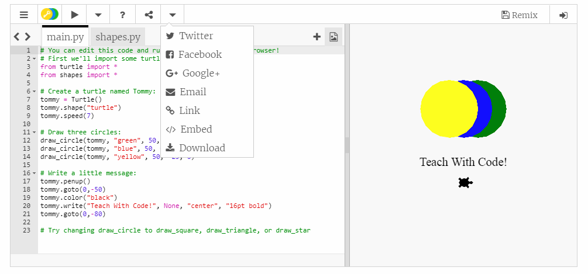
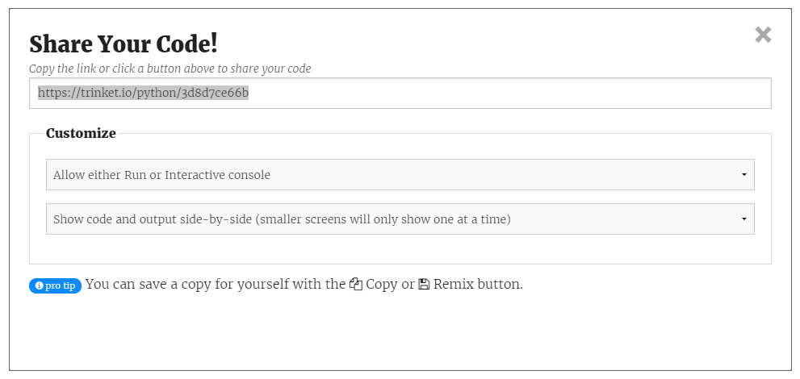

# Code Club
## Introduction
This is a small repo with some examples, links and resources used for code club.  Information on the code club movement can be found on their [website](https://www.codeclub.org.uk/).

The code club currently runs two modules
* scratch for beginners
* Python for intermediate/advanced

All beginners start at the code [club project site](https://codeclubprojects.org/en-GB/).  All the information required to get started is located here with links to small starter projects and all the teaching material.

## Scratch
Scratch is a free, graphical programming language that can be run on many devices and also online.

With Scratch, you can program your own interactive stories, games, and animations — and share your creations with others in the online community.

Scratch helps young people learn to think creatively, reason systematically, and work collaboratively — essential skills for life in the 21st century.

We are currently using Scratch version 3 or above.

A scratch [quiz](https://scratch.mit.edu/projects/17920411/) is a good way to test your knowledge.

### How do I do jumping
Jumping is covererd [here](https://en.scratch-wiki.info/wiki/Jumping)

### Links
The scratch [homepage](https://scratch.mit.edu/) will give you all the information to get started. You can either download scratch and install it locally or if you have an internet connection you can create scratch projects online and save them to your computer locally.

The offline version of scratch is available on most mobile devices.

The windows download can be found [here](https://scratch.mit.edu/download)

## Python
Python is a widely used high-level programming language for general-purpose programming. An interpreted language, Python has a design philosophy that emphasizes code readability (notably using whitespace indentation to delimit code blocks rather than curly brackets or keywords), and a syntax that allows programmers to express concepts in fewer lines of code than might be used in other languages.

Python interpreters are available for many operating systems, allowing Python code to run on a wide variety of systems. You can download it from the links below or if you have an internet connection then you can use Trinket.io to run python online.  Both are free and do not require any account sign up.

We are currently using Python version 3 or above.

### Saving your work with Trinket.IO when working at school
Its good practice to save your work regularly.  However, due to restrictions on download at school you will need follow these steps to save your work:
1.  Create a word document on your computer in your documents area.  Name it Python_Projects.doc.
2.  Once you are ready to save, use the 'link' option on trinket to generate a web address.
    
3.  Copy this web address and paste it into your new word document.
    
4.  Save the document.

When you want to load your work to continue:
1.  Open your word document, Python_Projects.doc.
2.  Copy the web address you saved from your last session and paste it into your web browser address bar.

### Integrated Development Environments (IDEs)
An integrated development environment (IDE) is a software application that provides comprehensive facilities to computer programmers for software development. An IDE normally consists of a source code editor, build automation tools and a debugger. Most modern IDEs have intelligent code completion.

Moving from Scratch to Python is, visually, a bit of a jump.  If you are using trinket then this may not be much of an issue but if you choose to download the Python interpreter onto your local machine then you may want to consider installing a Python IDE.

There are many options but for starting out I would choose either:
* [PyCharm Community Edition](https://www.jetbrains.com/pycharm/download/#section=windows)
* [PyScripter](https://sourceforge.net/projects/pyscripter/)

Both are free and do not require you to create an account.  **They must be downloaded and installed after you have installed the Python interpreter.**

### Links
There is an introduction to python and trinket on the [code club projects site](https://codeclubprojects.org/en-GB/resources/python-intro/)

You can download python from the python [website](https://www.python.org/)

